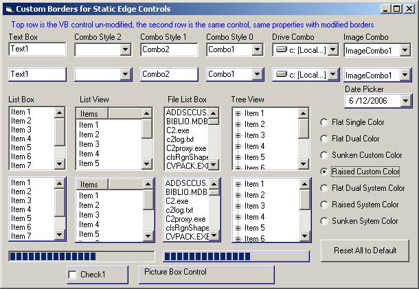



## FYI: Custom Border Colors: Static Edges

### Description

Ever want to change the textbox, listbox, and other common control border colors to something besides grayscale? The attached is one solution using Paul Caton's safe subclassing technique. The project was started for someone else that couldn't use it as is, so I posted it per his recommendation. It has limitations, but might be something worth playing with or maybe even using. Added &amp; tested a few more controls, cleaned up remarks/unused code.
 
### More Info
 

             |
---                |---
**Submitted On**   |2006-06-12 11:20:02
**By**             |[LaVolpe](https://github.com/Planet-Source-Code/PSCIndex/blob/master/ByAuthor/lavolpe.md)
**Level**          |Intermediate
**User Rating**    |5.0 (55 globes from 11 users)
**Compatibility**  |VB 5\.0, VB 6\.0
**Category**       |[Graphics](https://github.com/Planet-Source-Code/PSCIndex/blob/master/ByCategory/graphics__1-46.md)
**World**          |[Visual Basic](https://github.com/Planet-Source-Code/PSCIndex/blob/master/ByWorld/visual-basic.md)
**Archive File**   |[FYI\_\_Custo2000486122006\.zip](https://github.com/Planet-Source-Code/lavolpe-fyi-custom-border-colors-static-edges__1-65641/archive/master.zip)

